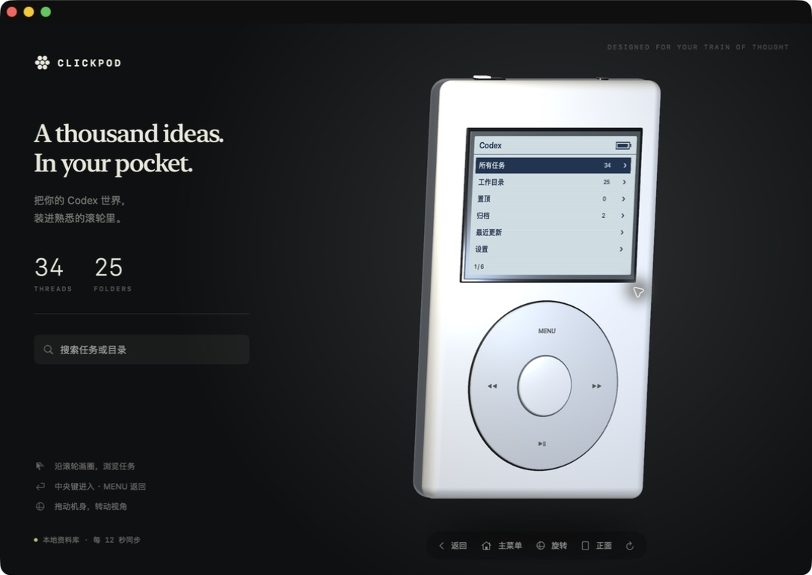

# ClickPod

**把你的 Codex 世界，装进熟悉的滚轮里。**

ClickPod 是一个原生 Mac 应用：实时渲染在 Blender 中构建的 3D iPod，用经典单色菜单和滚轮交互浏览本机 Codex 任务。

[English](README.md) · [下载 Mac 应用](https://github.com/GouGouGouuu/ClickPod/releases/latest)



## 功能

- 真实 3D 机身：白色外壳、金属背板、屏幕和滚轮，支持拖动旋转。
- 经典操作：滚轮画圈选择、中央键进入、MENU 返回，可关闭的点击声。
- 读取本机保存的全部任务，包括归档和代理子任务。
- 支持搜索、置顶、归档、最近更新、工作目录分组和可滚动摘要。
- 每 12 秒自动刷新，也可手动刷新；从详情页打开对应 Codex 任务。
- 支持鼠标、触控板和键盘。

## 下载与兼容性

从 [Releases](https://github.com/GouGouGouuu/ClickPod/releases/latest) 下载 `ClickPod-v1.0.0-macOS-arm64.zip`，解压后打开 `ClickPod.app`。也可将应用拖入「应用程序」。

- **需要 Apple Silicon（M 系列）Mac。当前版本不支持 Intel Mac、Windows 或 Linux。**
- 最低部署版本 macOS 14；已在 macOS 26 实测，未在 macOS 14/15 真机验证。
- 那台 Mac 需要有 Codex 的本地任务资料库。运行应用不需要安装 Blender，也不需要 API key。
- 当前版本是本地临时签名，**尚未通过 Apple 公证**，下载后可能被 macOS 安全检查拦截；也可以自行编译源码。

**应用界面主要为简体中文，含英文品牌文案；文档提供中英文版本，应用暂不提供语言切换。**

## 如何操作

- 顺时针沿灰色滚轮画圈向下选择，逆时针向上选择。鼠标滚轮和触控板也可浏览。
- 中央键进入；MENU 返回。详情页再次按中央键，在 Codex 中打开对应任务。
- 点击机身获得焦点后，↑ / ↓ 选择，Return 或空格进入，Escape / ← 返回。
- 拖动白色机身旋转。底部「旋转」模式允许从滚轮开始拖动；「正面」恢复视角。
- 搜索匹配任务标题和工作目录名称，按回车在屏幕中显示结果。
- ⌘H 主菜单，⌘R 同步，⌘0 恢复正面；设置菜单可关闭滚轮声。

## 编程语言与技术

- **Swift**：原生应用、菜单状态、屏幕绘制、输入处理、应用图标。
- **SwiftUI + AppKit**：窗口、搜索、工具栏与无障碍支持。
- **SceneKit / Metal**：实时渲染 Blender 导出的网格。
- **Python / Blender `bpy`**：机身建模、倒角、法线、材质与网格导出。
- **Shell**：构建、本地签名与发布打包。
- **SQLite**：只读访问本机 Codex 任务索引。

无需网页运行时、第三方 Swift 包、服务器或账户密钥。

## 任务从哪里来

只读打开 `~/.codex/state_*.sqlite` 中数字版本最高的文件。可用 `CODEX_HOME` 环境变量指定其他资料目录。应用不读取账户密钥、不修改任务数据库、不上传任务内容。

**仅显示当前 Mac 数据库中保存的任务。** 未同步到本机的远程设备任务、云端任务和 ChatGPT 对话不会自动出现。复制应用到另一台电脑不会复制你的任务。

「工作目录」按路径末级目录名分组；同名目录会合并，并非 Codex 正式项目。详情展示数据库保存的元数据和摘要，没有摘要时使用首条用户消息。不根据更新时间猜测运行状态。

当前接入的是 Codex 内部 SQLite 格式，而非稳定公共 API；如果未来字段变化，可能需要更新 ClickPod，界面会显示读取错误。

## 编译

安装 Xcode Command Line Tools 后，在仓库根目录运行：

```sh
bash build.sh
```

生成 `ClickPod.app`，目标为 arm64/macOS 14。使用系统框架，不需要额外 Swift 依赖。仓库已附模型资源，不修改模型就不需要 Blender。

若需重新生成模型，在空 Blender 场景的 Python Console 中运行：

```python
import runpy
runpy.run_path('/absolute/path/ClickPod/Source/build_model.py')
```

脚本会替换当前场景并保存 `Assets/iPod.blend` 和 `Assets/ipod-mesh.json`。随后重新构建应用。机身网格来自 Blender；动态 LCD 和按钮文字由应用实时绘制。

## 打包与自测

```sh
bash package.sh
./ClickPod.app/Contents/MacOS/ClickPod --self-test
CODEX_HOME=/tmp/clickpod-nonexistent ./ClickPod.app/Contents/MacOS/ClickPod --self-test-error
```

第一项自测需要可读的 Codex 数据库，覆盖导航、边界、详情、目录、归档和空搜索；第二项检查资料库不存在时的错误处理。更多验证范围见 [VALIDATION.md](VALIDATION.md)。

仓库包含 `Source/` 源码、`Assets/` 模型和图标、构建及打包脚本。已编译应用在 Releases 下载，不纳入 Git 源码历史。

这是独立制作的 iPod 致敬作品，与 Apple 或 OpenAI 无关联，也未获得其背书。相关产品名称归其各自权利人所有。
